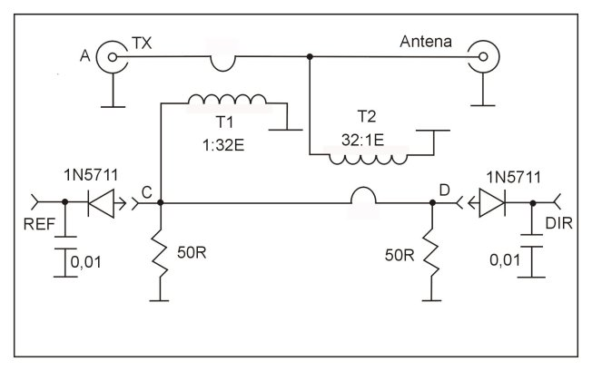

# Arduino Nano HF SWR/POWER meter
Arduino Nano based SWR/POWER meter, which can measure SWR and POWER on HF bands from 10-100 mW up to 110W. It is based on popular design with tandem match on binocular toroids and calibrated by using built in power meter from commercial HF transceiver.

